# Proposed Master Firm Profile: Laura A. Barwick CPA, LLC
<!-- CountingFive — Proposed MFP: pending client review and confirmation -->
<!-- Client review step: confirm, edit, or delete individual items before finalizing -->
<!-- Source audit: barwickcpa.com dated 2026-05-21 -->

---

## Section 1 — Firm Identity

| Field | Value |
|-------|-------|
| **Domain** | barwickcpa.com |
| **URL** | https://www.barwickcpa.com/ |
| **Firm Name** | Laura A. Barwick CPA, LLC |
| **Year Established** | 2011 (May) |
| **Firm Size Estimate** | 8 named staff |
| **MFP Date** | 2026-05-21 |
| **Prepared By** | CountingFive |

### Location(s)

**Bel Air Office (Primary — and only)**

| Field | Value |
|-------|-------|
| **Address** | 218 Fulford Ave, Bel Air, MD 21014 |
| **Phone** | (410) 692-5283 |
| **Email** | info@barwickcpa.com |
| **Business Hours** | Mon–Thu 8:30 AM – 5:00 PM · Fri 8:30 AM – 3:00 PM · Sat–Sun Closed |

> 📋 **Client Review Action:** Confirm that Bel Air is the only physical office (a stale Mapquest listing references Fallston). Confirm contact email and the lack of a fax line.

---

## Section 2 — Firm Narrative

### History & Background
Laura A. Barwick CPA, LLC was founded in **May 2011** by Laura A. Barwick, CPA, after she left a prior firm to launch her own public accounting practice. The firm is now in its **15th year** of operation, serving small businesses, nonprofits, churches, optometrists, and professional service providers across Harford County and the greater Bel Air market. Laura is a University of Baltimore alumna, a Maryland Association of CPAs (MACPA) member, and a current member of the **Harford County Chamber of Commerce Board of Directors**. The firm operates from a single office at 218 Fulford Ave, Bel Air, MD.

### Current Positioning
> "We are passionate about our clients' success."

The homepage currently leads with a relationship and outcomes message — *passion, success, working with clients* — and uses a tiled "Who We Serve" grid (Churches, Nonprofits, Professional Service Providers, Service-based Businesses) as the primary niche differentiator. Service framing on the homepage is mostly horizontal and template-driven ("What we do"), not niche-tagged.

### Proposed Positioning

Three framings — each built on the same differentiators (15-year tenure, niche depth in churches/nonprofits/optometry, Quality Business Award winner, Chamber Board service, EA on staff) but leading with a different emphasis. Client selects one in the review session.

> **Option A — The Niche-Authority Angle ("The Bel Air CPA for mission-driven and service-based businesses")**
> The only Bel Air CPA firm that has built dedicated practice areas around churches, nonprofits, optometrists, and professional service providers — backed by 15 years of local practice, a 4.7-star Google rating across 24 reviews, and 2026 Quality Business Awards for Bel Air North and Bel Air South. Where other Harford County firms are generalists, we are intentionally niche.

> **Option B — The Long-Tenured Local Trust Angle ("Harford County's CPA for fifteen years")**
> Since 2011, Laura Barwick CPA has been Harford County's choice for tax, accounting, payroll, and bookkeeping — built on the kind of long-term relationships that earn 4.7-star reviews, a board seat on the Harford County Chamber, and two 2026 Quality Business Awards. The same CPA who handled your 990 last year is the one answering the phone today.

> **Option C — The Big-Firm Expertise, Small-Town Service Combination ("CPA depth, neighbor accessibility")**
> Run by a University of Baltimore-trained CPA with 20+ years of public accounting experience and a tax specialist with the IRS-recognized EA credential — but small enough that you'll work with the same team year after year. Local enough to serve on the Chamber Board; experienced enough to handle audits, reviews, and Form 990 compliance for the region's nonprofits.

*All three grounded in: 15-year tenure (since 2011), Chamber Board service, MACPA membership, 2026 Quality Business Awards (Bel Air North + South), 4.7-star Google rating (24 reviews), Lori Snyder's EA credential, dedicated niche pages already in place for churches/nonprofits/optometrists/PSPs, and Laura's i95 Business press features.*

> 📋 **Client Review Action:** Select preferred positioning option (A, B, or C) or note which elements to blend. This becomes the foundation of homepage copy, service page intros, and Google Business Profile description.

### Competitive Context

| Firm | Location | Size | Nonprofit/Church Niche Claimed | Positioning Notes |
|---|---|---|---|---|
| Bishop & Adkins, P.A. | Bel Air, MD | small | ❌ | "Personal, Quality Tax Services" — 30-year generalist tax/accounting firm, no stated niches. |
| KatzAbosch | Bel Air + Timonium HQ | regional | ✅ | "Create. Grow. Protect." — Accounting Today Top-200 regional firm with deep verticals incl. nonprofit, construction, real estate, healthcare. The upmarket competitor. |
| Curran & Co. CPAs | Bel Air, MD | small | ❌ | "Committed To Your Success" — generalist small-business and individual tax. |
| Seling & Associates, Inc. | Bel Air + Ellicott City | small | ❌ | "Put A SELING On Your Taxes" — tax prep, estate work, IRS representation across two offices. |
| Greater Harford Accounting | Bel Air (multi-town) | solo | ❌ | "Reliable Accounting That Solves Real Problems" — responsiveness-focused new entrant. |
| Diepold & Associates, LLC | Bel Air, MD | small | ❌ | "Your Local CPA Firm" — audit-experienced, IRS examination defense, SmartCEO Magazine award. |
| Thomas M. Wagner & Associates | Bel Air, MD | small | ❌ | "The home town accountants" — Harford County generalist since 1996. |
| BLRR CPA (Boyle, Loveless, Reilly & Reilly) | Harford & Cecil County | small | ❌ | "Committed to our clients' financial success" — full-service generalist, estates & trusts. |

**Key Competitive Takeaways:**
- **Defensible niches:** Of 8 local competitors, only one (KatzAbosch) claims nonprofit as a vertical — and KatzAbosch competes upmarket with multi-million-dollar nonprofits. **Churches, optometrists, and small-to-mid nonprofits are wide-open territory** for a Bel Air firm with Barwick's positioning.
- **Commoditized claims:** "Tax preparation," "small business accounting," and "IRS representation" are claimed (explicitly or implicitly) by 6 of 8 firms — these are table-stakes, not differentiators.
- **Clearest competitive moat:** **Niche depth at small-to-mid scale.** No Bel Air competitor combines (a) named niche landing pages, (b) gated niche eBooks, and (c) the personalized service of a small firm. Barwick already has the infrastructure — the rebuild is about activating it.
- **Recent developments:** Greater Harford Accounting is a relatively new entrant explicitly positioning against unresponsive competitors — worth monitoring as a low-end disruptor.

> 📋 **Client Review Action:** Confirm competitor list. Are there others we should know about (private referrals, recent local hires from larger firms)? Any competitive developments already affecting client conversations?

---

## Section 3 — Accreditations, Awards & Affiliations

| Organization | Type | Evidence |
|---|---|---|
| Quality Business Awards 2026 — Bel Air North | Award | Awarded "Best-Rated" CPA / accounting firm 2026 (top 1% by review rating) — not displayed on site. |
| Quality Business Awards 2026 — Bel Air South | Award | Second 2026 win for the adjacent service area — not displayed on site. |
| Maryland Association of CPAs (MACPA) | Membership | Referenced in i95 Business profile; Laura A. Barwick named MACPA member. |
| Harford County Chamber of Commerce | Board of Directors | Laura A. Barwick currently sits on the Board (i95 Business "Harford's Healthy Heart" announcement). |
| Expertise.com listing | Third-party recognition | Bel Air CPA firm listing visible. |
| Better Business Bureau (BBB) | Listed, not accredited | BBB profile exists for the firm but no accreditation status. |
| American Institute of CPAs (AICPA) | Membership (inferred from CPA license) | Confirm in client review. |

> 📋 **Client Review Action:** Confirm AICPA membership; confirm any state CPA society committee involvement; confirm any prior years' Quality Business Awards or other local recognitions we may have missed.

---

## Section 4 — Social & Digital Footprint

| Platform | URL | Followers | Activity | Notes |
|---|---|---|---|---|
| Google Business Profile | (claimed — 4.7-star rating, 24 reviews) | n/a | Active | Strongest single trust signal — positive theme: responsiveness; no significant concerns. |
| Facebook (firm) | facebook.com/barwickcpa | unknown | Moderate | Birthday posts, hiring posts, occasional client highlights — most "active" of the firm's social. |
| LinkedIn (Company) | linkedin.com/company/barwick-cpa-llc | ~74 | Low | Largely dormant company page; staff connections drive most LinkedIn presence. |
| LinkedIn (Founder) | linkedin.com/in/laura-barwick-cpa-904807a | ~684 | Low–moderate | Laura's personal profile — occasional tax-tip posts and hiring announcements. |
| Instagram | (firm IG handle) | 68 followers / 290 posts | Low | High post count, low audience — content not engaging. |
| Twitter / X | @LauraBarwickCPA | low | Dormant | Last meaningful activity ~2018 — newsletter promos, tax deadlines. |
| YouTube | *(not found)* | — | — | No firm channel. |

**Google Business Profile:** ★ 4.7 (24 reviews) — recurring praise: responsiveness, accessibility, personal service.
**Review Summary:** Positive overall sentiment, no documented concern themes. 24 reviews is modest absolute volume but well above several competitors with 0–5 reviews.

> 📋 **Client Review Action:** Confirm whether the firm wants to consolidate or sunset the dormant X account; confirm Instagram strategy (continue posting, or pause).

---

## Section 5 — Who They Serve

*Source: Audit target market analysis + team expertise cross-reference*

### Confirmed Target Markets

Laura A. Barwick CPA, LLC explicitly serves five named audiences via dedicated "Who We Serve" pages: **Churches, Nonprofits, Professional Service Providers, Optometrists, and Service-based Businesses** (plus a generic "Small Businesses" page included in the sitemap but not surfaced in homepage navigation). The firm's homepage tiles foreground churches, nonprofits, PSPs, and service-based businesses; the optometry niche is reachable only by direct URL or sitemap navigation. External evidence (i95 Business mentions, Harford Nonprofits Facebook threads naming Laura as a go-to 501(c)(3)/990 accountant) reinforces the nonprofit/church credibility beyond the site's own copy. The optometry niche has no external evidence trail beyond the site itself — verify origin and current client base in review.

**Identified Industries:**

| Industry | Confidence | Evidence |
|---|---|---|
| Nonprofits | Confirmed | Dedicated /who-we-serve/nonprofits page; gated "eBook-Nonprofit" PDF; external i95 Business and Harford Nonprofits FB references. |
| Churches / Faith-Based | Confirmed | Homepage tile + /who-we-serve/churches page; "eBook-Churches" PDF; positioning aligned with stewardship/treasurer language. |
| Professional Service Providers (consultants, agencies, coaches) | Confirmed | Homepage tile + dedicated page + "eBook-PSP" PDF. |
| Optometrists | Confirmed (site) — weak external | Dedicated /who-we-serve/optometrists page; no external press or client signal — confirm origin. |
| Service-based Businesses (generic) | Weak signal | Homepage tile but language is horizontal/generic; reads as catch-all rather than vertical. |
| Small Businesses (generic) | Weak signal | Sitemap page exists; not surfaced in nav; horizontal segment. |

### Ideal Client Profile (ICP)
*Draft one ICP per confirmed industry. Base on audit data, team expertise research, and industry knowledge. Client confirms/corrects/adjusts in the review session.*

> 📋 **Client Review Action:** For each ICP, mark ✅ Accurate | ✏️ Adjust (note changes) | ❌ Remove. Add typical revenue size, how clients find you, and what makes a great client vs. a difficult one.

**Nonprofit ICP**
*A 501(c)(3) nonprofit with $250K–$5M in annual revenue, run by a small staff and a volunteer board.*

- **Business type:** Community-based 501(c)(3) charities, foundations, advocacy organizations
- **Size range:** $250K–$5M revenue; 2–25 staff; board of 7–15
- **Stage:** Established (5+ years) or rapidly growing post-grant
- **What triggers a search:** Form 990 panic, new ED hiring, failed audit, grant compliance pressure
- **What they fear:** Loss of 501(c)(3) status, board liability, unrelated business income, donor mistrust
- **What they value:** A CPA who speaks "fund accounting," answers the phone before tax season ends, and explains 990 line items to a non-financial board
- **Ideal signal:** *"Our treasurer is leaving and we need someone who can walk us through the 990 and our annual audit without making us feel stupid."*

**Church / Faith-Based ICP**
*A 100- to 500-member congregation with a volunteer treasurer who is overwhelmed by stewardship accounting.*

- **Business type:** Independent churches, multi-site campuses, denominational parishes
- **Size range:** $250K–$3M annual giving; volunteer or part-time bookkeeper
- **Stage:** Established congregation in a growth or rebuild phase
- **What triggers a search:** Treasurer turnover, audit committee request, pastor-led financial transparency initiative
- **What they fear:** Misappropriation rumors, IRS scrutiny on housing allowances, donor restricted-fund missteps
- **What they value:** A CPA who treats stewardship with reverence, understands clergy compensation/housing allowance rules, and gives lay leaders confidence
- **Ideal signal:** *"Our new senior pastor wants the elders to see clean books and a real audit. We need help getting there."*

**Professional Service Providers ICP**
*A 3- to 25-person consulting, coaching, or agency business outgrowing its founder-only bookkeeping.*

- **Business type:** Management consultants, marketing agencies, executive coaches, professional services firms
- **Size range:** $500K–$5M revenue; founder + 2–25 staff
- **Stage:** Beyond solopreneur but pre-mid-market; first or second key hire
- **What triggers a search:** Hitting the S-corp election threshold, hiring first W-2 employee, project profitability blindness
- **What they fear:** Quarterly tax surprises, project profitability erosion, retirement-plan/owner-comp inefficiency
- **What they value:** A CPA who understands billable utilization, retainer revenue recognition, and owner draws vs. salary tradeoffs
- **Ideal signal:** *"We just signed our biggest retainer and I don't trust the books to tell us if we're actually making money on it."*

**Optometrist ICP**
*A solo or 2-OD optometry practice in eastern Maryland with $750K–$3M revenue.*

- **Business type:** Independent optometry practice (not chain-affiliated)
- **Size range:** $750K–$3M revenue; 4–15 staff
- **Stage:** Post-acquisition, expansion, or succession-planning
- **What triggers a search:** Practice acquisition, second-location decision, succession or buy-sell agreement
- **What they fear:** Equipment depreciation strategy, optical-vs-medical revenue mix tax treatment, third-party payer cash-flow surprises
- **What they value:** A CPA who understands per-exam profitability, optical inventory accounting, and the financing math of a $250K equipment purchase
- **Ideal signal:** *"I'm being offered my partner's share and I have no idea if it's a fair price."*

---

### Industry Sub-Category Assessment
*Evaluates each served industry against known accounting sub-specializations. Sourced from site copy, niche analysis, and digital intelligence.*
*Status key: ✅ Confirmed on site — explicitly in copy | 🔍 Likely offered — strong inference | ❓ Verify in client review*

**Nonprofits** *(industry not in master sub-category table — using profession-specific sub-list)*

| Sub-Category | Status | Notes |
|---|---|---|
| Form 990 Preparation & Compliance | 🔍 | Strongly implied by nonprofit positioning + Lori Snyder EA capability; not explicitly named on page. |
| Single Audit / Yellow Book Audit Compliance | ❓ | Site lists "Audits, Compilations & Reviews" — confirm whether nonprofit single-audit work is in scope. |
| Restricted Fund / Grant Tracking | ❓ | Likely offered as part of managed accounting but not described. |
| Board Reporting & Financial Statement Presentation | 🔍 | Implied by ED/treasurer-facing positioning. |
| Unrelated Business Income (UBIT) Analysis | ❓ | Verify with client. |

**Churches** *(industry not in master sub-category table — using profession-specific sub-list)*

| Sub-Category | Status | Notes |
|---|---|---|
| Clergy Housing Allowance & Compensation | ❓ | Not mentioned on church page — confirm in review (high-leverage niche signal if true). |
| Restricted Giving & Stewardship Fund Accounting | 🔍 | Implied by faith-based positioning. |
| Annual Audit or Review for Member Confidence | 🔍 | Audit & Review service on site supports this. |
| Payroll & Clergy-Specific Payroll | 🔍 | Payroll service exists; clergy specifics not stated. |
| Donor-Restricted vs. Unrestricted Fund Reporting | ❓ | Verify. |

**Professional Services**

| Sub-Category | Status | Notes |
|---|---|---|
| Client & Project Profitability | 🔍 | Implied by managed-accounting positioning. |
| Project Tracking & Scope Control | ❓ | Not stated; verify. |
| Utilization & Productivity Tracking | ❓ | Verify. |
| Rate Analysis & Pricing Strategy | ❓ | Verify. |
| Partner Compensation & Growth | ❓ | Verify (high-value if true for agency clients). |

**Optometrist (Healthcare-style sub-list)**

| Sub-Category | Status | Notes |
|---|---|---|
| Per-Procedure / Per-Exam Profitability | ❓ | Not stated on optometry page. |
| Optical Inventory Accounting | ❓ | Verify. |
| Provider Compensation & Equity Structures | ❓ | Verify for 2-OD partnerships. |
| Practice Acquisition / Buy-In Financing | ❓ | Verify — high-value if confirmed. |
| Insurance / Vision-Plan AR Management | ❓ | Verify. |

**Service Businesses (generic)**

| Sub-Category | Status | Notes |
|---|---|---|
| Job Profitability Tracking | 🔍 | General fit. |
| Team Productivity & Efficiency | ❓ | Verify. |
| Materials & Inventory Management | ❓ | Verify. |
| Recurring Revenue & Service Contracts | 🔍 | Managed Accounting Solutions supports this. |
| Growth & Capacity Planning | ❓ | Verify. |

> 📋 **Client Review Action:** For each ❓, give a quick yes/no on whether the firm currently offers it. ✅ items become page-section anchors; ❓→✅ items become new content for the rebuilt site.

---

### Team-Derived Audience Opportunities
*These audiences are not currently marketed to, but team expertise supports serving them:*

- **Laura A. Barwick** has expertise in **audits, reviews, and compilations** (LinkedIn specialties) → Unleveraged audience: **mid-size nonprofits requiring annual audits**, currently captured by KatzAbosch upmarket.
  *Opportunity: A Bel Air firm small enough to serve a $1M–$5M nonprofit personally but credentialed enough to issue a formal audit opinion is rare in Harford County.*

- **Lori Snyder, EA** has expertise in **IRS representation** (EA credential) → Unleveraged service: **individual and small-business IRS audit defense / collections representation**, currently captured by Diepold & Associates and Seling.
  *Opportunity: Bel Air has two competitors leading with IRS representation; Barwick's EA credential is equally credible but not externalized.*

---

## Section 6 — Services Inventory

*Source: Audit niche & services intelligence + team expertise cross-reference*

**Niche Clarity Score:** 4.3/10 | **Grade:** D

### Confirmed Services

The site exposes **15 service pages** under /what-we-do — a much fuller services menu than the homepage suggests. Most pages are template-driven and not niche-tagged.

| Service | Clarity | Current Framing | Rewrite Direction |
|---|---|---|---|
| Tax (preparation & planning) | Moderate | Mixed | Re-frame as separate niche tax workflows: nonprofit/990, church/clergy, optometry practice, PSP S-corp/quarterly. |
| Bookkeeping | Clear | Process-focused | Add per-niche bookkeeping framings (fund accounting for nonprofits, optical inventory for OD practices). |
| Payroll | Clear | Process-focused | Add clergy payroll and PSP-payroll specifics. |
| Managed Accounting Solutions | Unclear | Process-focused | Define what's bundled, when a client graduates into it, sample client outcomes. |
| Audits, Compilations & Reviews | Moderate | Process-focused | This is a hidden differentiator — feature it prominently for nonprofit/church audience. |
| Personal Tax Prep & Planning | Clear | Mixed | Tighten with HNW-leaning copy. |
| Business Foundation Services | Unclear | Process-focused | Rebrand as "New Business Setup" or merge into a Startup service line. |
| Entity Type Analysis | Clear | Process-focused | Strong sub-feature inside a "Starting a Business" page. |
| Accounting System Setup | Clear | Process-focused | Pair with QuickBooks Consulting as a single onboarding offer. |
| Retirement Plan Analysis | Clear | Process-focused | High-value for PSP audience — frame as owner-comp/SEP/Solo-401(k) strategy. |
| Credit Card Rewards (advisory) | Unclear | Process-focused | Either eliminate or fold into business-management bundle — distracting standalone. |
| Business Management Services | Unclear | Process-focused | Consolidate with Managed Accounting Solutions. |
| Cash Management | Moderate | Process-focused | Frame as outcome-focused: "Know your runway." |
| QuickBooks Consulting | Clear | Process-focused | Outcome-frame: "Books that match your tax return." |

> 📋 **Client Review Required — "Managed Accounting Solutions" Details**
> This appears to be the firm's primary recurring-revenue service. The content strategy for this page depends on these details — please bring to the review session:
> - What is specifically included in Managed Accounting Solutions (full-charge bookkeeping? CFO calls? KPI reporting?)?
> - Who is the ideal client (revenue size, industry, stage)?
> - Current pricing structure (flat fee tiers, hourly, hybrid)?
> - Approximately how many active Managed Accounting clients are enrolled today?
> - 1–2 specific client outcomes you're proud of (before/after, dollar impact, decision made)?

---

### High-Opportunity Niches (Currently Invisible)

| Niche | Rationale |
|---|---|
| Closely held family businesses (multi-generation succession) | Common in Harford County; aligns with audit, entity, and retirement plan services already on site; no Bel Air competitor leads here. |
| Estate & succession planning for SMBs | Seling and BLRR claim "estate" loosely; Barwick has audit + retirement + entity-analysis foundation to build a dedicated practice. |
| Construction / trades subcontractors | Strong Harford County employer base; competitors don't lead with it. |
| Real estate investors (small landlords, 1031, cost seg) | Suburban DC/Baltimore commuter market; no local competitor owns this. |

### Team-Derived Service Opportunities

- **Laura A. Barwick** has expertise in **audits & reviews** → Unleveraged service: **standalone Nonprofit Audit Engagement page** with sample timeline, cost framing, and "what to expect."
  *Market case: Mid-size nonprofits regularly Google "nonprofit audit Bel Air" — no Bel Air competitor owns the result; KatzAbosch dominates because of brand, not relevance.*

- **Lori Snyder, EA** has expertise in **IRS representation** → Unleveraged service: **standalone IRS Representation / Audit Defense page** for individuals and small businesses.
  *Market case: Diepold and Seling lead with this in Bel Air; Barwick's EA is at least as credible and is invisible.*

---

## Section 7 — Team & Credentials

### Laura A. Barwick, CPA
**Title:** Managing Member / Founder
**External Footprint:** Moderate

| Attribute | Detail |
|---|---|
| **Credentials** | CPA |
| **Previous Employers** | Prior public accounting firm (specifics not surfaced) |
| **Areas of Expertise** | Tax planning & preparation, audits, reviews, nonprofit accounting (per LinkedIn specialties) |
| **Niche Signals** | Nonprofits, churches, professional service providers, optometrists, Harford County SMBs |
| **Associations** | MACPA member; Harford County Chamber Board of Directors; AICPA (inferred) |
| **Published / Speaking** | i95 Business "Protecting & Growing Your Business" panel; i95 Business "Harford's Healthy Heart" (Board announcement) |

**Bio Summary:** University of Baltimore-trained CPA who founded the firm in May 2011 after years in public accounting. Sits on the Harford County Chamber Board of Directors; respected regional nonprofit/990 reference. Personal LinkedIn (~684 followers) is active; X account is dormant.

**Leverage Opportunities:**
- Chamber Board service and 15-year operating history → put on homepage as authority signals, not just on About.
- Nonprofit audit experience → standalone Nonprofit Audit service page (see Section 6).

---

### Jordan Huna
**Title:** Senior Accountant
**External Footprint:** Minimal

| Attribute | Detail |
|---|---|
| **Credentials** | *(none surfaced)* |
| **Previous Employers** | *(not found)* |
| **Areas of Expertise** | Bookkeeping, budget reporting (per LinkedIn) |
| **Niche Signals** | *(none surfaced)* |
| **Associations** | *(none found)* |
| **Published / Speaking** | *(none found)* |

**Bio Summary:** Long-tenured firm staffer (referenced in firm Facebook posts going back several years). Towson University. LinkedIn presence is sparse.

**Leverage Opportunities:**
- Tenure with the firm is itself a trust signal — surface "years with Barwick" in About bios.

---

### Lori Snyder, EA
**Title:** Tax Specialist
**External Footprint:** Minimal

| Attribute | Detail |
|---|---|
| **Credentials** | EA (Enrolled Agent) |
| **Previous Employers** | *(not found)* |
| **Areas of Expertise** | Tax representation, IRS work (implied by EA credential) |
| **Niche Signals** | Individual & SMB tax |
| **Associations** | *(none found)* |
| **Published / Speaking** | *(none found)* |

**Bio Summary:** Johns Hopkins University. Carries the IRS-recognized Enrolled Agent credential — a federally regulated tax-practice authority equivalent to a CPA for IRS matters. Underused asset externally.

**Leverage Opportunities:**
- Build a dedicated IRS Representation / Audit Defense page with Lori as the named lead (Diepold and Seling both lead with this in the market; Barwick has equal credentialing).

---

### Caleb Riley
**Title:** Accountant
**External Footprint:** Minimal

| Attribute | Detail |
|---|---|
| **Credentials** | *(none surfaced — Salisbury University grad)* |
| **Previous Employers** | *(not found)* |
| **Areas of Expertise** | General accounting |
| **Niche Signals** | *(none surfaced)* |
| **Associations** | *(none found)* |
| **Published / Speaking** | *(none found)* |

**Bio Summary:** Early-career accountant; modest LinkedIn presence (~258 followers). Confirm whether he is on a CPA-candidate path.

**Leverage Opportunities:**
- If on the CPA exam path, frame as "next-generation" team member in About bios.

---

### Tracy Fuller
**Title:** Client Accounting Specialist
**External Footprint:** Minimal

| Attribute | Detail |
|---|---|
| **Credentials** | *(none surfaced)* |
| **Previous Employers** | *(not found — UT Dallas education)* |
| **Areas of Expertise** | Client-facing bookkeeping |
| **Niche Signals** | *(none surfaced)* |
| **Associations** | *(none found)* |
| **Published / Speaking** | *(none found)* |

**Bio Summary:** Newer team member; thin LinkedIn presence. No external authority signals.

---

### RoxAnn Fritsch
**Title:** Client Accounting Specialist
**External Footprint:** Minimal

| Attribute | Detail |
|---|---|
| **Credentials** | *(none surfaced)* |
| **Previous Employers** | *(not found — Aberdeen, MD area per FB)* |
| **Areas of Expertise** | Client-facing bookkeeping |
| **Niche Signals** | *(none surfaced)* |
| **Associations** | *(none found)* |
| **Published / Speaking** | *(none found)* |

**Bio Summary:** No external professional footprint outside firm Facebook activity.

---

### Megan Gullion
**Title:** Client Support Specialist
**External Footprint:** Minimal

| Attribute | Detail |
|---|---|
| **Credentials** | *(none surfaced)* |
| **Previous Employers** | *(not found)* |
| **Areas of Expertise** | Front-of-house, client support |
| **Niche Signals** | *(none surfaced)* |
| **Associations** | *(none found)* |
| **Published / Speaking** | *(none found)* |

**Bio Summary:** Client experience role; no public-facing authority footprint expected for the position.

---

### Anita Cochran
**Title:** Client Support Specialist
**External Footprint:** Minimal

| Attribute | Detail |
|---|---|
| **Credentials** | *(none surfaced)* |
| **Previous Employers** | *(not found)* |
| **Areas of Expertise** | Front-of-house, client support |
| **Niche Signals** | *(none surfaced)* |
| **Associations** | *(none found)* |
| **Published / Speaking** | *(none found)* |

**Bio Summary:** Client experience role; no external footprint expected.

---

## Section 8 — Reputation & Trust Signals

**Overall Sentiment:** Positive
**Google Rating:** ★ 4.7 (24 reviews)
**Yelp Rating:** Listing unclaimed, 0 reviews
**BBB Status:** Listed, not accredited

### Review Themes
**Praise:** Responsiveness, accessibility, personal service, year-round availability
**Concerns:** *(none surfaced)*

### Press & Media
- i95 Business — "Protecting & Growing Your Business" feature panel (PDF / digital)
- i95 Business — "Harford's Healthy Heart" Board of Directors announcement
- Harford Nonprofits Facebook community — Laura named as 501(c)(3)/990 expert (2022 thread)
- Quality Business Awards 2026 — Bel Air North & Bel Air South winner

### Trust Signal Gaps
*Elements that exist externally but are missing from the website:*
- **No Quality Business Award badges on site** despite winning both Bel Air North and Bel Air South in 2026.
- **No on-site testimonials cross-referenced to the 24 Google reviews** — every review is a missed homepage quote.
- **No press logo strip** ("As seen in i95 Business…") despite at least two named features.
- **No Chamber Board credential surfaced on Laura's bio** — a meaningful local-authority signal.
- **No 15-year anniversary milestone messaging** for a firm that crossed the 15-year mark in May 2026.
- **Yelp listing unclaimed** — quick win to claim and seed with existing client reviews.

---

## Section 9 — Content Gap Analysis

### Niche Gaps
*Audiences or industries the firm has credibility to serve but has zero (or thin) web presence for:*
- **Closely held family businesses** — Harford County is full of multi-generation businesses; Barwick has the entity-analysis, retirement, and audit chops but no dedicated page.
- **Estate & succession planning for small business owners** — Strong adjacency to Retirement Plan Analysis and Entity Type Analysis; competitors only loosely claim this.
- **Construction / trades subcontractors** — Major Harford employer category; no Bel Air competitor leads here.
- **Real estate investors (small landlords, 1031, cost seg)** — Suburban Baltimore market; nobody local owns this search result.

### Authority Gaps
*Credentials, awards, pedigree, and tenure that are not visible on the site:*
- **Two 2026 Quality Business Awards** — not displayed on homepage, about page, or any service page.
- **Harford County Chamber of Commerce Board of Directors** seat — buried, not surfaced in Laura's bio.
- **MACPA membership** — not mentioned on site.
- **15-year firm anniversary** (May 2011 → May 2026) — no anniversary milestone messaging.
- **EA credential for Lori Snyder** — name-tag only; not leveraged as a service-page anchor.
- **i95 Business press features** — no press logo strip or in-page references.
- **Laura's University of Baltimore education and 20+ years of public accounting** — absent from the website.

### Conversion Gaps
*Missing elements that would help website visitors become clients:*
- **Generic CTAs only** ("Get In Touch", "Client Center") — no niche-specific CTAs ("Schedule a Nonprofit 990 Review", "Request an Optometry Practice Profitability Check").
- **No on-site testimonials** despite 24 positive Google reviews.
- **No case studies / client success stories** for any niche.
- **Niche landing pages are thin** — banner image + eBook download is not a conversion experience.
- **Yelp listing unclaimed** — easy local-SEO conversion win.
- **No appointment-booking embed** (Calendly, Acuity, or similar) on Contact page.

### Team Expertise Gaps
*Capabilities the firm has but doesn't market:*
- **Laura A. Barwick** — Nonprofit audit experience → no dedicated Nonprofit Audit Engagement page.
- **Lori Snyder, EA** — IRS representation credential → no dedicated IRS Representation / Audit Defense page.
- **Laura A. Barwick** — Chamber Board service → not surfaced as a community-authority signal.

---

## Section 10A — Current Site Map

*134 URLs in published sitemap.xml as of 2026-05-21. Used for redirect planning during site rebuild. Resources index (105 URLs) is collapsed below — full list is in the firm's sitemap.xml.*

| Current URL | Page Title | Status |
|---|---|---|
| / | Home | Live |
| /who-we-are | Who We Are | Live |
| /who-we-serve | Who We Serve (index) | Live |
| /who-we-serve/churches | Churches | Live |
| /who-we-serve/nonprofits | Nonprofits | Live |
| /who-we-serve/optometrists | Optometrists | Live |
| /who-we-serve/professional-service-providers | Professional Service Providers | Live |
| /who-we-serve/service-based-businesses | Service-based Businesses | Live |
| /who-we-serve/small-businesses | Small Businesses | Live (in sitemap; not in homepage nav) |
| /what-we-do | What We Do (index) | Live |
| /what-we-do/accounting-system-setup | Accounting System Setup | Live |
| /what-we-do/audits-compilations-and-reviews | Audits, Compilations & Reviews | Live |
| /what-we-do/bookkeeping | Bookkeeping | Live |
| /what-we-do/business-foundation-services | Business Foundation Services | Live |
| /what-we-do/business-management-services | Business Management Services | Live |
| /what-we-do/cash-management | Cash Management | Live |
| /what-we-do/credit-card-rewards | Credit Card Rewards | Live |
| /what-we-do/entity-type-analysis | Entity Type Analysis | Live |
| /what-we-do/managed-accounting-solutions | Managed Accounting Solutions | Live |
| /what-we-do/payroll | Payroll | Live |
| /what-we-do/personal-tax-prep-planning | Personal Tax Prep & Planning | Live |
| /what-we-do/quickbooks-consulting | QuickBooks Consulting | Live |
| /what-we-do/retirement-plan-analysis | Retirement Plan Analysis | Live |
| /what-we-do/tax | Tax | Live |
| /resources | Resources (index) | Live |
| /resources/blog | Blog | Live |
| /resources/e-books | E-books (index, 9 individual eBooks) | Live |
| /resources/magazine | Magazine (90+ individual articles) | Live |
| /resources/forms-documents-and-links | Forms, Documents & Links | Live |
| /careers | Careers (index) | Live |
| /careers/accountant | Accountant | Live |
| /careers/bookkeeper | Bookkeeper | Live |
| /careers/tax-manager | Tax Manager | Live |
| /contact | Contact | Live |
| /services | *(none)* | → redirects silently to / (no 301; HTTP 200 + JS redirect) |
| /about | *(none)* | → redirects silently to / |
| /about-us | *(none)* | → redirects silently to / |
| /team | *(none)* | → redirects silently to / |
| /clients | *(none)* | → redirects silently to / |
| /industries | *(none)* | → redirects silently to / |
| /contact-us | *(none)* | → redirects silently to / |

### Redirect Planning Table

*Developers: implement these as proper HTTP 301 redirects before or immediately at launch. The current behavior (HTTP 200 + JS-based redirect to /) is bad for SEO link equity and for users who land on old bookmarks.*

| Current URL | Current Page | Action | New URL |
|---|---|---|---|
| / | Home | 📈 Rebuild | / |
| /who-we-are | Who We Are | 301 Redirect | /about |
| /who-we-serve | Who We Serve (index) | 301 Redirect | /industries |
| /who-we-serve/churches | Churches | 301 Redirect | /industries/churches |
| /who-we-serve/nonprofits | Nonprofits | 301 Redirect | /industries/nonprofits |
| /who-we-serve/optometrists | Optometrists | 301 Redirect | /industries/optometrists |
| /who-we-serve/professional-service-providers | PSPs | 301 Redirect | /industries/professional-services |
| /who-we-serve/service-based-businesses | Service-based Businesses | Consolidate | → /industries/professional-services |
| /who-we-serve/small-businesses | Small Businesses | Consolidate | → /industries (index) |
| /what-we-do | What We Do (index) | 301 Redirect | /services |
| /what-we-do/tax | Tax | 301 Redirect | /services/tax |
| /what-we-do/personal-tax-prep-planning | Personal Tax | Consolidate | → /services/tax (subsection) |
| /what-we-do/bookkeeping | Bookkeeping | 301 Redirect | /services/bookkeeping |
| /what-we-do/payroll | Payroll | 301 Redirect | /services/payroll |
| /what-we-do/managed-accounting-solutions | Managed Accounting | 301 Redirect | /services/managed-accounting |
| /what-we-do/audits-compilations-and-reviews | Audits & Reviews | 301 Redirect | /services/audits-and-reviews |
| /what-we-do/business-foundation-services | Business Foundation | Consolidate | → /services/business-startup |
| /what-we-do/business-management-services | Business Mgmt | Consolidate | → /services/managed-accounting |
| /what-we-do/entity-type-analysis | Entity Analysis | Consolidate | → /services/business-startup |
| /what-we-do/accounting-system-setup | Accounting Setup | Consolidate | → /services/business-startup |
| /what-we-do/quickbooks-consulting | QuickBooks Consulting | Consolidate | → /services/bookkeeping (subsection) |
| /what-we-do/retirement-plan-analysis | Retirement Plans | Consolidate | → /services/advisory (subsection) |
| /what-we-do/cash-management | Cash Management | Consolidate | → /services/advisory (subsection) |
| /what-we-do/credit-card-rewards | Credit Card Rewards | Sunset | *(remove from new site — distracting and off-strategy)* |
| /resources/blog | Blog | 301 Redirect | /resources/blog |
| /resources/e-books/* | E-books (9 PDFs) | No Change (keep URLs stable; gate behind new forms) | /resources/e-books/* |
| /resources/magazine/* | Magazine articles (90+) | 301 Redirect | /resources/articles/* |
| /resources/forms-documents-and-links | Forms & Links | 301 Redirect | /resources/client-tools |
| /careers | Careers | No Change | /careers |
| /careers/accountant | Accountant role | No Change | /careers/accountant |
| /careers/bookkeeper | Bookkeeper role | No Change | /careers/bookkeeper |
| /careers/tax-manager | Tax Manager role | No Change | /careers/tax-manager |
| /contact | Contact | 📈 Rebuild | /contact |
| /services (legacy) | *(currently JS-redirects to /)* | 301 Redirect | /services |
| /about (legacy) | *(currently JS-redirects to /)* | 301 Redirect | /about |
| /about-us (legacy) | *(currently JS-redirects to /)* | 301 Redirect | /about |
| /team (legacy) | *(currently JS-redirects to /)* | 301 Redirect | /about/team |
| /clients (legacy) | *(currently JS-redirects to /)* | 301 Redirect | /industries |
| /industries (legacy) | *(currently JS-redirects to /)* | 301 Redirect | /industries |
| /contact-us (legacy) | *(currently JS-redirects to /)* | 301 Redirect | /contact |
| *(no current URL)* | *(n/a — new content)* | New Page | /industries/family-business |
| *(no current URL)* | *(n/a — new content)* | New Page | /industries/construction |
| *(no current URL)* | *(n/a — new content)* | New Page | /services/irs-representation |
| *(no current URL)* | *(n/a — new content)* | New Page | /services/nonprofit-audit |
| *(no current URL)* | *(n/a — new content)* | New Page | /about/awards-recognition |
| *(no current URL)* | *(n/a — new content)* | New Page | /testimonials |

---

## Section 10B — Proposed Site Map

*Tailored to Laura A. Barwick CPA, LLC's confirmed services (15 service pages), identified niches (churches, nonprofits, PSPs, optometrists), 8-person team structure, and content gap analysis.*
*Annotation key: ✅ existing content (needs polishing) · 🆕 new page (addresses a gap) · 📈 exists but needs major depth improvement*

```mermaid
graph TD
    Home["🏠 Home 📈"] --> About["About 📈"]
    Home --> Services["Services 📈"]
    Home --> Industries["Industries 📈"]
    Home --> Resources["Resources ✅"]
    Home --> Careers["Careers ✅"]
    Home --> Contact["Contact 📈"]

    About --> Story["Our Story 🆕"]
    About --> Team["Our Team 🆕"]
    About --> Awards["Awards & Recognition 🆕"]
    About --> Community["Community & Chamber 🆕"]

    Services --> Tax["Tax 📈"]
    Services --> Bookkeeping["Bookkeeping 📈"]
    Services --> Payroll["Payroll 📈"]
    Services --> Managed["Managed Accounting 📈"]
    Services --> AuditReview["Audits & Reviews 📈"]
    Services --> IRSRep["IRS Representation 🆕"]
    Services --> NonprofitAudit["Nonprofit Audit Engagements 🆕"]
    Services --> BusinessStartup["Business Startup 📈"]
    Services --> Advisory["Advisory & Cash Strategy 📈"]

    Industries --> Churches["Churches 📈"]
    Industries --> Nonprofits["Nonprofits 📈"]
    Industries --> Optometrists["Optometrists 📈"]
    Industries --> PSP["Professional Services 📈"]
    Industries --> FamilyBiz["Family Businesses 🆕"]
    Industries --> Construction["Construction & Trades 🆕"]

    Resources --> Blog["Blog ✅"]
    Resources --> Articles["Articles / Magazine ✅"]
    Resources --> EBooks["E-books ✅"]
    Resources --> ClientTools["Client Tools & Forms ✅"]
    Resources --> Testimonials["Testimonials & Results 🆕"]

    Careers --> Open["Open Roles ✅"]
```



**Why this structure:**
- **About → Awards & Recognition (🆕)** addresses two 2026 Quality Business Awards and the i95 Business press features that are entirely absent from the current site (authority gap in Section 9).
- **About → Community & Chamber (🆕)** surfaces Laura's Harford County Chamber Board service — a meaningful local-authority signal that's currently invisible.
- **Services → IRS Representation (🆕)** activates Lori Snyder's EA credential, which directly counters Diepold and Seling's local positioning.
- **Services → Nonprofit Audit Engagements (🆕)** activates Laura's audit/reviews expertise into a dedicated landing surface — a niche where only KatzAbosch competes upmarket.
- **Industries → Family Businesses (🆕)** and **Construction & Trades (🆕)** address two high-opportunity niches with strong Harford County market fit and no competitor ownership.
- **Industries → existing niche pages (📈)** because the URLs already exist but each is essentially a banner + eBook download (Section 9 — niche pages are empty shells).
- **Resources → Testimonials & Results (🆕)** addresses the conversion gap of 24 positive Google reviews invisible on the site.
- Several /what-we-do pages (Credit Card Rewards, Business Management Services, Entity Type Analysis, Cash Management, Accounting System Setup) are **consolidated** into broader service pages rather than carried forward — current site has 15 service pages, several of which dilute the menu.

**Site Map — Text Tree**

```
Home 📈
├── About 📈
│   ├── Our Story 🆕
│   ├── Our Team 🆕
│   ├── Awards & Recognition 🆕
│   └── Community & Chamber 🆕
├── Services 📈
│   ├── Tax 📈
│   ├── Bookkeeping 📈
│   ├── Payroll 📈
│   ├── Managed Accounting 📈
│   ├── Audits & Reviews 📈
│   ├── IRS Representation 🆕
│   ├── Nonprofit Audit Engagements 🆕
│   ├── Business Startup 📈
│   └── Advisory & Cash Strategy 📈
├── Industries 📈
│   ├── Churches 📈
│   ├── Nonprofits 📈
│   ├── Optometrists 📈
│   ├── Professional Services 📈
│   ├── Family Businesses 🆕
│   └── Construction & Trades 🆕
├── Resources ✅
│   ├── Blog ✅
│   ├── Articles / Magazine ✅
│   ├── E-books ✅
│   ├── Client Tools & Forms ✅
│   └── Testimonials & Results 🆕
├── Careers ✅
│   └── Open Roles ✅
└── Contact 📈
```

---

## Section 11 — Before You Review

*Read this before your MFP review session. Most items just need a "yes / correct / delete." The items below are what we cannot research — gathering them in advance keeps the session on strategy.*

### What to Have Ready

**About the firm:**
- [ ] Confirm 2011 founding date and whether to highlight the May 2026 15-year milestone publicly
- [ ] Confirm only one office location (Bel Air); confirm Fallston Mapquest entry should be removed
- [ ] Any corrections to firm history, staff count, titles, or credentials in Section 7
- [ ] Any other awards, certifications, or memberships missing from Section 3 (years past, MACPA committees, etc.)
- [ ] Caleb Riley CPA candidate status — yes / no
- [ ] Lori Snyder additional credentials (NTPI Fellow? Audit defense track?)

**About Managed Accounting Solutions (your flagship recurring-revenue product):**
- [ ] What's specifically included in the engagement (full-charge bookkeeping? CFO calls? KPI reporting?)
- [ ] Ideal client profile (revenue size, industry, stage)
- [ ] Current pricing structure (flat-fee tiers, hourly, hybrid)
- [ ] Approximate number of active Managed Accounting clients
- [ ] 1–2 specific client outcomes you're proud of (before/after, dollar impact, decision made)

**About your clients:**
- [ ] Rough breakdown of current book by industry (e.g., "~30% nonprofit/church, ~25% PSP, ~15% optometry, ~30% generic SMB")
- [ ] Typical client revenue size for each niche
- [ ] How clients most commonly find you (referral, Google, Chamber, association)
- [ ] 2–3 specific client success stories — one per industry if possible. Format: *"Client type, situation they came to us with, what we did, what the outcome was."* These become case-study copy on industry pages.

**About the optometry niche specifically:**
- [ ] How did this niche start? Personal connection? Referral? Acquired client?
- [ ] How many active optometry clients today?
- [ ] Should we keep, deepen, or sunset this niche?

**About the new services and niches we've flagged:**
- [ ] For each item in "High-Opportunity Niches" (Section 6): do you currently offer it, or would you need to build it? (yes / not yet / maybe)
- [ ] For each ❓ in Section 5 sub-category tables: quick yes/no on whether you offer it
- [ ] IRS Representation as a standalone service — would you actively pursue this market?

**About your competitive landscape:**
- [ ] Any corrections or additions to the competitor list in Section 2
- [ ] Any recent competitive developments you're aware of (firms acquired, partners departed, new entrants)?

**Visual and content assets:**
- [ ] Professional headshots: which team members have them?
- [ ] Office photos?
- [ ] Any nonprofit-event or community photos (Chamber events, church partnerships, etc.)?
- [ ] Existing videos or recorded talks?
- [ ] Any existing blog articles worth keeping or repurposing (vs. the templated vendor content)?

### What We'll Decide Together in the Session

1. Which positioning option resonates — or what to blend (A / B / C)
2. Whether to keep or sunset the optometrist niche
3. Whether to add IRS Representation and Nonprofit Audit Engagements as standalone services
4. Whether to add Family Businesses and Construction & Trades as new industry pages
5. Final sitemap — which proposed pages to build, which to defer
6. Content priorities — what gets written first

---

## Section 12 — Pipeline Tracker

| Stage | Status | Notes |
|---|---|---|
| Audit Delivered | ✅ Complete | audit-barwickcpa-com-2026-05-21.html |
| Proposed MFP Generated | ✅ Complete | This document |
| Client MFP Review | ⬜ Pending | |
| MFP Confirmed | ⬜ Pending | |
| Content Strategy | ⬜ Pending | |
| Content Generation | ⬜ Pending | |
| Site Onboarded | ⬜ Pending | |

---

*Proposed Master Firm Profile — CountingFive — Turning Accounting Expertise Into Online Authority*
*Generated: 2026-05-21 | Source audit: audit-barwickcpa-com-2026-05-21.html | Status: Pending client review*
